# AIDD 30-Day Challenge — Task 8 

***Calculator Project with Speckit Plus***

## Phase 1: Constitution

### Command
```
/sp.constitution "Simple calculator with basic operations only"
```

### Output
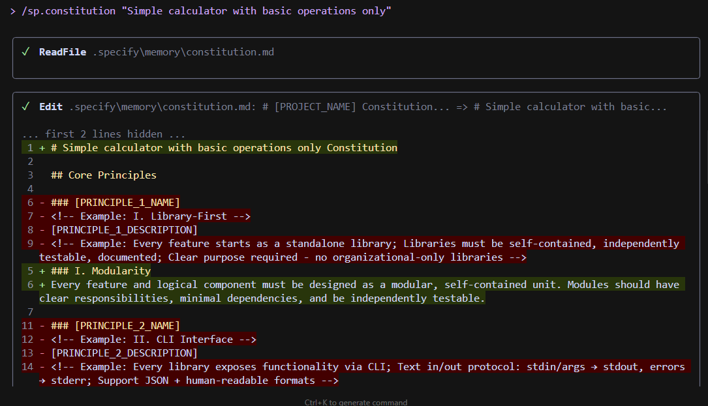


## Phase 2: Specify

### Command
```
/sp.specify "Calculator: input expr(string) -> output result(number)"
```

### Output 

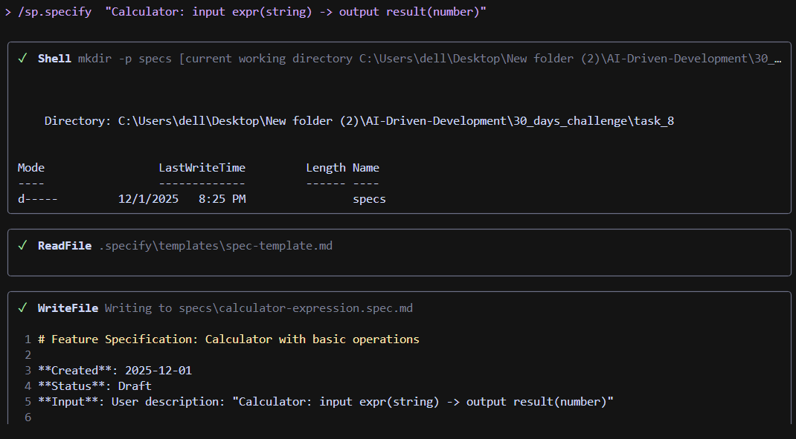


## Phase 3: Plan

### Command
```
/sp.plan "Plan: take expression -> validate -> evaluate -> return number"
```

### Output

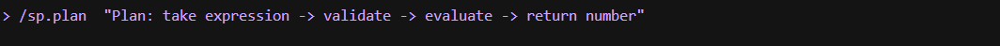
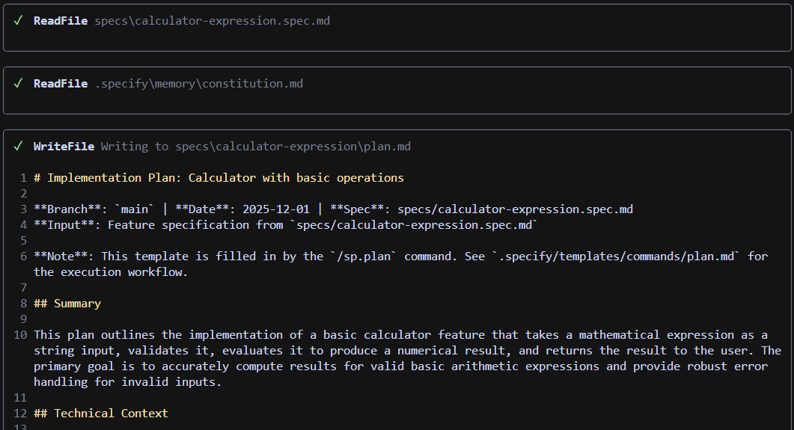


## Phase 4: Tasks

### Command
```
/sp.tasks "Context for task generation: 1. Recieve input 2. Validate expression 3. Evaluate safely 4. Return results"
```

### Output
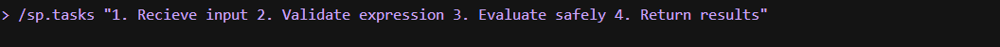
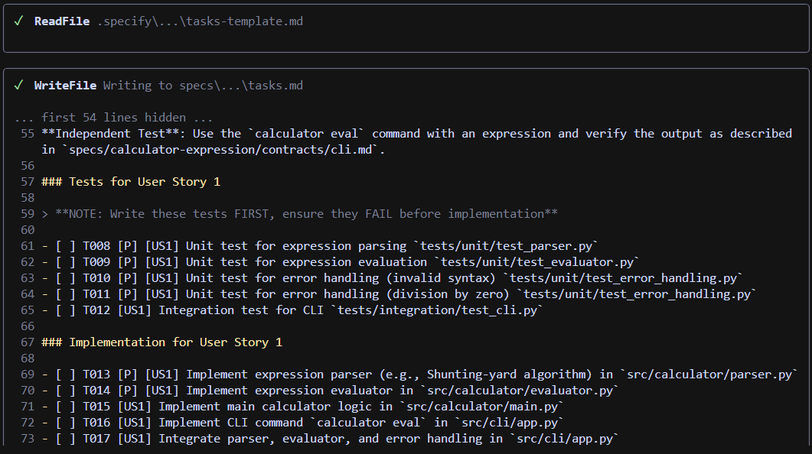


## Phase 5: Implement

### Command
```
/sp.implement "Implement calculator"
```

### Output
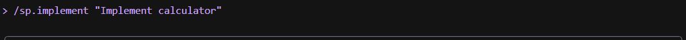
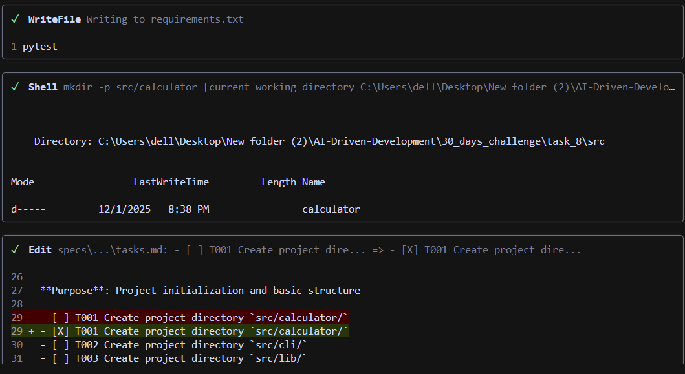

-----

## Calculator Tests Screenshots

### Screenshot 1
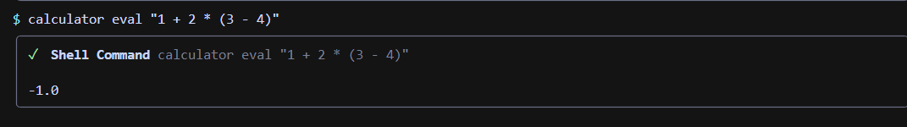

### Screenshot 2
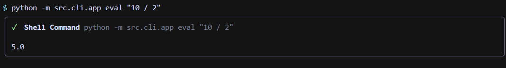

### Screenshot 3
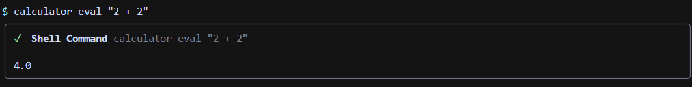
